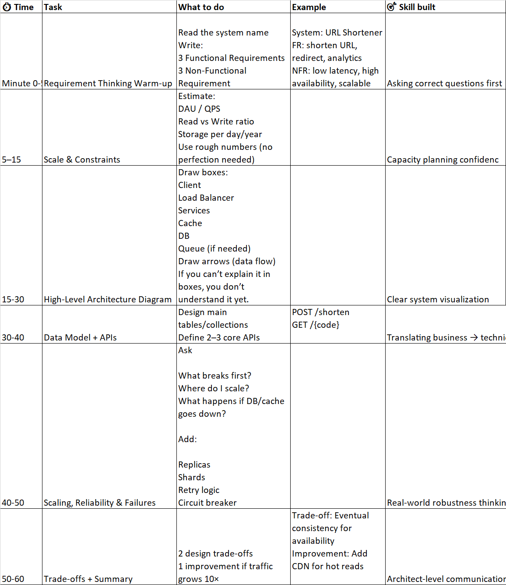

.

🧠 How to Think About HLD (First – Very Important)

Every system design follows the same mental framework:

1. Functional requirements
2. Non-functional requirements
3. Traffic estimation
4. High-level architecture diagram
5. Data model
6. APIs
7. Scaling
8. Failure handling
9. Trade-offs

# 1. Requirements (functional + non-functional)
Define what the system should do (functional requirements) and how well it should perform (non-functional requirements).
# 2. Traffic & Scale Estimation
Estimate the expected load on the system, including user base, requests per second, data storage needs
# 3. Core Components
Identify the main building blocks of the system, such as databases, servers, load balancers,
caches, and message queues.
# 4. Data Model
Design the structure of the data, including how it will be stored, accessed, and managed.
# 5. APIs
Define the interfaces through which different components of the system will communicate.
# 6. Scaling & Reliability
Plan for how the system will handle increased load and ensure high availability.
# 7. Bottlenecks & Trade-offs
Identify potential performance bottlenecks and discuss trade-offs in design decisions.

⏱️ Daily 60-Minute HLD Practice Schedule (Repeat Daily)

✅ 2-Month HLD Plan

🟩 WEEK 1 (Days 1–7) — HLD Foundations

Goal: Understand HLD mindset & basic building blocks

Day 1: What is HLD + URL Shortener (basic)

Day 2: Pastebin

Day 3: User Profile Service

Day 4: Authentication / Login System

Day 5: Simple Blog System

Day 6: Key-Value Store

Day 7: Revision Day
→ Redraw Day 1–3 systems faster (30 min each)

🟩 WEEK 2 (Days 8–14) — Scale, Traffic & Data

Goal: Think in numbers and storage

Day 8: File Storage System

Day 9: Image Hosting Service

Day 10: Logging System

Day 11: Metrics Collection System

Day 12: Analytics Counter

Day 13: Rate Limiter

Day 14: Revision Day
→ Explain 2 systems aloud + refine estimates

🟩 WEEK 3 (Days 15–21) — Cache & Performance

Goal: Reduce latency and DB load

Day 15: Product Catalog

Day 16: Search Autocomplete (Typeahead)

Day 17: Session Management

Day 18: Leaderboard System

Day 19: Recommendation Engine (HLD only)

Day 20: Content Feed (basic)

Day 21: Revision Day
→ Add cache + CDN to earlier designs

🟩 WEEK 4 (Days 22–28) — Scaling & Load

Goal: Remove bottlenecks & SPOFs

Day 22: E-commerce Backend

Day 23: Order Management System

Day 24: Inventory System

Day 25: Payment Gateway

Day 26: Coupon / Promotion Service

Day 27: Cart Service

Day 28: Revision Day
→ Full E-commerce redesign (end-to-end)

🟩 WEEK 5 (Days 29–35) — Async & Distributed Systems

Goal: Reliability via messaging

Day 29: Email Service

Day 30: Notification System

Day 31: Event Processing System

Day 32: Kafka-based Order Flow

Day 33: Log Aggregation System

Day 34: Retry + DLQ Design

Day 35: Revision Day
→ Failure scenarios & recovery paths

🟩 WEEK 6 (Days 36–42) — Consistency & Advanced Data

Goal: Handle data safely at scale

Day 36: Chat System

Day 37: Messaging Queue Internals

Day 38: Presence Service

Day 39: Distributed Cache

Day 40: Multi-Tenant SaaS System

Day 41: Tenant-aware DB & Sharding

Day 42: Revision Day
→ CAP trade-offs discussion

🟩 WEEK 7 (Days 43–49) — Large-Scale Systems

Goal: Think like a Solution Architect

Day 43: WhatsApp

Day 44: Facebook / Instagram Feed

Day 45: Google Search (HLD)

Day 46: YouTube

Day 47: Uber

Day 48: Swiggy / Zomato

Day 49: Revision Day
→ Explain 2 systems in 30 minutes each

🟩 WEEK 8 (Days 50–56) — Interview & Confidence Mode

Goal: Design ANY system in 45 minutes

Day 50: Random system (timer 45 min)

Day 51: Improve same system

Day 52: Add 10× traffic

Day 53: Add multi-region support

Day 54: Add failure scenarios

Day 55: Whiteboard / verbal practice

Day 56: Final Review & Self-Assessment

🎯 Optional Add-on

🔹15-minute Add-on (2–3 days/week)

Rate limiting algorithms

Consistent hashing (deeper)

Feed ranking logic

Leaderboard optimization

✅ WHAT YOU SHOULD DO (Very Important)

1️⃣ Follow the SAME 60-Minute Structure Daily (No Skipping)

2️⃣ Draw Diagrams (Paper or Draw.io)

3️⃣ Speak Out Loud (Critical 🔥)

4️⃣ Make Trade-offs Explicit

Every design must include at least 2 trade-offs.

Example:

“Using cache increases complexity but reduces DB load”

“Eventual consistency improves availability”

Architects are judged by trade-off clarity, not perfect answers

5️⃣ Reuse Concepts Aggressively

6️⃣ Maintain a “Design Journal” (Simple)

One page per system:

* Key decisions
* Mistakes you made
* What you’d change next time

7️⃣ ❌ Don’t Watch Too Many Videos
Design first → watch video → improve

😰 “I Don’t Know This System” — EXACTLY What To Do & What NOT To Do

    Not knowing a system is NORMAL.
    Architects are judged on thinking, not prior knowledge.
✅ WHAT YOU SHOULD DO (Step-by-Step Rescue Plan)

1️⃣ DO NOT PANIC (Most Important)

2️⃣ Start With a Generic System Skeleton (Always Works)

    Client
    ↓
    Load Balancer
    ↓
    Service
    ↓
    Cache
    ↓
    Database

Forget optimization.

Ask:

    “What is the simplest system that can satisfy the requirement?”

Example:

    Need to store data → Single DB
    
    Need to serve requests → Single service
    
    Need fast access → Basic cache

3️⃣ Ask ONLY These 5 Questions (No More)

Write answers quickly (even if rough):

1. Who uses this system?
2. What is the main action?
3. Is it read-heavy or write-heavy?
4. Is latency critical?
5. Does data need to be consistent?

This converts unknown → known.

4️⃣ Ask the 4 Universal Pressure Questions

Q1. What breaks first if traffic increases?

    DB?    
    Service?    
    Network?

Q2. What is more important here?

    Consistency or Availability?    
    Latency or Accuracy?

Q3. What happens if this component fails?

    Can we retry?    
    Can we accept delay?    
    Can we lose data?

Q4. Which operation happens most?

    Read or Write?

5️⃣  Reduce the Problem Scope (Very Important)

You are NOT designing the full product.

Say:

    “I’ll design the core MVP flow first.”

Example:

    Chat system → send & receive messages only
    
    Uber → matching rider to driver only
    
    YouTube → upload + watch video only

Interviewers LOVE this.

6️⃣  Reuse Patterns You Already Know

You are allowed to say:

    “This is similar to X system I designed earlier”
    
    “I’ll reuse the same caching approach”

Architecture is pattern reuse, not invention.

7️⃣ Make Reasonable Assumptions (Say Them Clearly)

If unsure, say:

    “I’ll assume 10M users and read-heavy traffic.”

Making assumptions is a strength, not weakness.

8 Move Forward Even If Design Is Imperfect

Never freeze.

Bad design > No design
You can refine later.

### Use “DEFAULT SAFE CHOICES” (Very Important)

When unsure, use industry-default assumptions.

| Problem               | Default Safe Choice  |
|-----------------------|----------------------|
| Need scale            | Horizontal scaling   |
| Fast reads            | Cache (Redis)        |
| Async work            | Message queue        |
| Uncertain consistency | Eventual consistency |
| Growth expected       | Sharding later       |

### Use These 5 Universal Trade-offs

You can ALWAYS use one of these:

1. Performance vs Consistency
2.Simplicity vs Scalability
3.Availability vs Accuracy
4.Latency vs Cost
5.Speed of delivery vs Long-term flexibility

🔁 After You’re Stuck — How to Recover (Very Important)

After the session:

1.  Watch 1 good explanation

2. Compare with your design

3. Write 3 improvements only

4. Redraw next day (5–10 minutes)

This is where confidence grows fastest.

🏆 How You’ll Know You’re Confident

You can:
✅ Start design without fear
✅ Ask correct questions first
✅ Draw clean diagrams
✅ Explain trade-offs clearly
✅ Adapt design when requirements change

📚 Best Learning Resources (Minimal & Effective)
YouTube

Gaurav Sen (start here)

ByteByteGo

System Design Interview – Alex Xu

Book (Optional but powerful)

System Design Interview – Alex Xu (Vol 1)