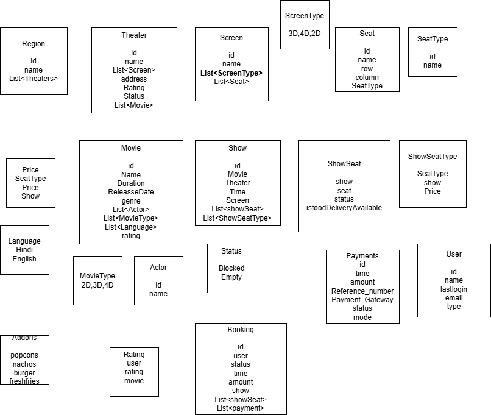

Step 0: Understand the problem by sharing your understanding
and clarify the question if any

Step 1: Requirements—Take 2-3 min and thing about the requirement then ask clarification question in one go
1. User will be able to book a movie ticket.
2. Our system can support multiple regions.
3. Each region can have multiple theater
4. Each theater can have multiple screens
5. Each theater might be running multiple different movie
6. Users can book seats in a show.
7. Show: movie, theater, time, screen, seat
8. Users can book different types of a seat.
9. One user can book at max 10 ticket in a particular ticket
10. No two people should be allowed to book same seats of a show.
11. price: show + seat type
12. For movies, we need to store name, duration, release_Date, genre, actor. 
13. Movie can have features - 2d,3d, dolloby, 4k. Languages
14. user is able to see the layout.
15. Only online payments are allowed. — reference number nad payment gateway
16. User should be able to see all bookings

17. Addons
18. Rating movie
19. Admin Portal
20. Discount and offers
21. Cancellation of ticket should be allowed
22. Upcoming movies
23. Search theater
24. Share your booking 
25. Invite people in booking
26. Notification - Email/SMS
27. Gift a movie ticket

Step 2: Class Diagram
* Physical structure
* user Journey
* Requirements

Step 3: Data Model

Step 4: create all models

Step 5: Controller
GET /region - return all regions
GET /region_info - return movies
GET /region_info/:movie - return theatre and show timmimg
GET /show_seats/showId - return all seats
POST /bookTickets

Step 6: Service Layer

**bookTicket**

//Get user from database

//Get Show from database

//Get Show seats

//check for availability of the seats

//if all are available, mark the status blocked

//Make sure db is updated with status

// otherwise throw exception

//Get booking object ready

//Find the total amount of seats

//Create, save and return booking object

**Learning**

Critical section seperation and wrap in 
@Transactional(isolation=Isolcation.SERIALIZABLE)