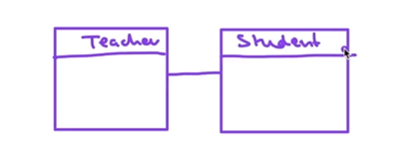
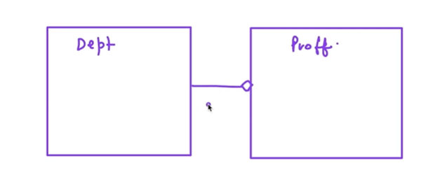
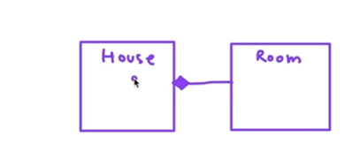
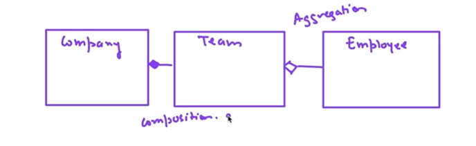
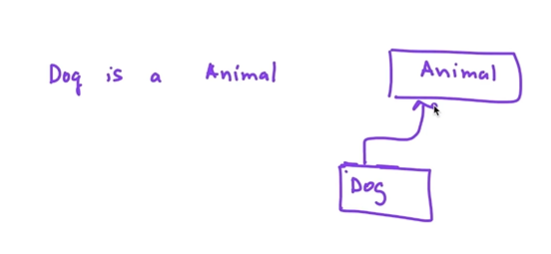
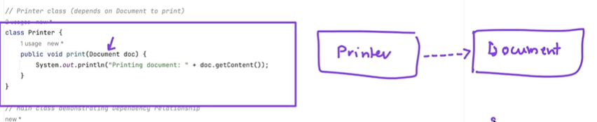

Uml diagram is of two types of Structural and behavioral.
Structural UML diagram - Code base id structured; Class diagram, pakage, component
Behavioral UML diagram — How your system works and interacts. What all features are supported. Use-case diagram, Sequence, Activity  

1. private indicate with - 
   public indicate with + 
   protected indicate with # 
    static indicates with underline
    Interface indicates by double arrow <<>>
    Abstract indicates by italic
    Imp repesents same as inheritance.
2. **Relations**:
3. **Association**: Objects are related but can exist independently.

    It's a has-a relationship, each object of one class is associated with one or more object of another class but can exist independently.

    Like a Teacher has a Student.

    
4.  **Aggregation**: A weak has-a relationship, where the contained objects can exist independently.

    It's a weak form of association; where one class contains object of another class. However, the contained objects can exist independently of the container object.

    The Department has a professor. where we have a list of professors in department class. Department and professor exist independently
    
    
5. **Composition**: A strong has-a relationship, where the contained objects cannot exist without the container.

    Its Strong form of association; where one class own object of another class. If contained clas destroyed, then contained object are destroyed as well.

    Example House and rooms. House class has-a rooms. but room can't exist without a house. that means if a house object destroyed then room object also be destroyed

   
6. Example of aggregation and composition together.
   Company teams employees --> Company and teams have composition relationship since of a company object detroyed then there is no significance of team object.
                   Teams and Employees have Aggregation Relationship

    
7. **Inheritance**—Its is-a relationship where subclass inherits properties and behavior of superclass

    
8. **Dependency** - This is a relationship where one class relies on another class in some way. Ofter through method parameters, return type or temporary associations.

    
9. **Realization**: A class implements the behavior defined by an interface.
 
