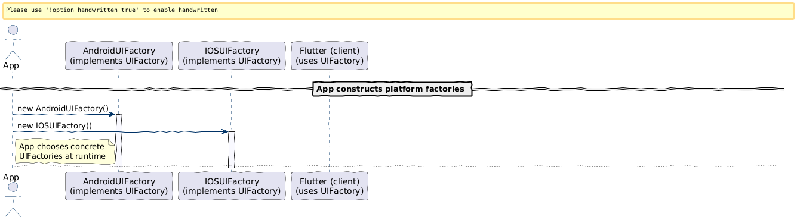

### Agenda
1. Singleton Design Pattern
2. Builder Design Pattern
3. Factory Design Pattern
4. Prototype Design Pattern

### Singleton Design pattern
> This design pattern ensures that a class has only one instance and provides a global point of access to that instance.

> This is typically achieved by making the class constructor private and providing a static method that returns the instance of the class.

> Use: Database connections, logging, configuration.

Advantage and Disadvantage

| **Advantage**                                                                                              | **Disadvantage**                                                                                                                              |
|--------------------------------------------------------------------------------------------------------|-------------------------------------------------------------------------------------------------------------------------------------------|
| 1. Single instance control   Ensures only one object exists (e.g., Logger, Configuration, Cache).  | 1.Hidden dependencies Classes using Singleton look independent but actually depend on it → bad for clean design.                      |
| 2. Global access point Easy to access from anywhere in the application                             | 2. Difficult unit testing Hard to mock or replace Singleton (especially static access). ❌ Breaks Dependency Injection principles. |
| 3. Resource saving  Useful when object creation is expensive (DB connection manager, thread pool). | 3. Global state problem Acts like a global variable → unexpected side effects, harder debugging.                                      |
| 4. Consistent state Shared data remains consistent across the app.                                 | 4. Concurrency issues Lazy initialization needs proper synchronization → performance overhead or bugs.                                |
|                                                                                                        | 5. Violates SOLID principles SRP: Manages its lifecycle + business logic DIP: High-level modules depend on concrete class         |
|                                                                                                        | 6. Scalability limitation Not suitable in distributed systems or microservices (multiple JVMs = multiple instances).                  |         
|                                                                                                        | 7. Hard to extend Inheritance and polymorphism become difficult.                                                                                                                         |

⚠️ When to Use Singleton

✔ Logging

✔ Configuration (read-only)

✔ Database connection pool

✔ Cache (carefully)

❌ When to Avoid

✘ Business logic

✘ Stateful services

✘ When Dependency Injection (Spring Beans) can do the job

💡 Spring Boot Note (Important for You)

In Spring, beans are Singleton by default, but managed by the container, which:

Supports DI

Is test-friendly

Handles lifecycle properly

👉 Prefer Spring-managed singleton beans over manual Singleton pattern

Implementation
1. Implement loggers using singleton pattern
2. Implement configuration manager using singleton pattern
3. Implement database connection pool using singleton pattern

### Builder Design pattern
> This design pattern is useful when you need to construct a complex object step by step. 
> It separates the construction of a complex object from its representation, 
> allowing the same construction process to create different representations.

**Problem**: Complex construction logic, Immutable Objects, Different Representations, Avoid Telescoping Constructor Problem, Code Clarity and Maintainability

**Solution**: A builder design pattern 
allows incremental and controlled construction of objects, 
you can reuse the same building process to create different types of objects,
keeps the creation logic separate from the representation of the final object.

**Applications**:
1. UI Builders: Building graphical user interfaces with complex layouts and styles.
2. Report Generators: Creating reports in different formats like PDF, Word, or HTML.
3. Vehicle Assembly: Constructing vehicles with customizable options (e.g., engine type, color, interiors).
4. Meal Builders: Designing combo meals in a restaurant ordering system.

[Code](https://github.com/KriticaGoel/JAVAConcepts/tree/master/DesignPattern/Creation/BuilderPatern)

### Factory Design pattern

Based on something we need object
like based on a device, we need an object
based on strategy, we need an object (if a Strategy Design pattern is there)

[Code](https://github.com/KriticaGoel/JAVAConcepts/tree/master/DesignPattern/Creation/Factory)
