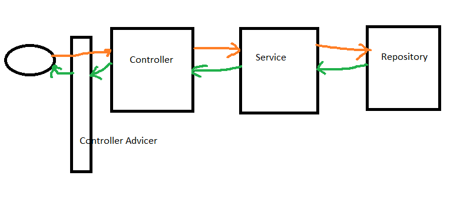
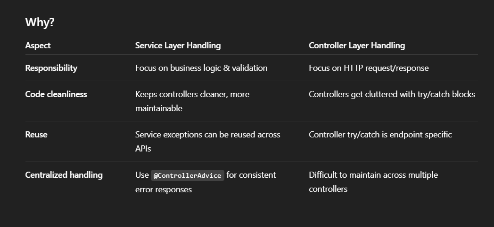

### AGENDA

1. [Spring boot components](#spring-boot-components)
2. [Advantage of spring boot](#advantage-of-spring-boot)
3. [Different tier](#different-tiers)
4. [Annotation](#annotations)
5. [Steps for implement Rest API](#steps-for-implement-rest-api)
6. [Basic program](#basic-program)
7. [ResponseEntity and ResponseStatusException](#responseentity-and-responsestatusexception)
8. [Validation in spring boot](#validation-in-spring-boot)
9. [Custom Exceptional Handling](#custom-exceptional-handling)
10. [DTO](#dto)
11. [ModelMapper](#modelmapper)
12. [RestTemplate](#RestTemplate)

Spring Boot = spring framework + prebuilt configuration + Embedded server

#### Spring boot components

* Spring Boot Starters
* Auto Configuration
* Spring Boot Actuator-monitor the application
* Embedded Server
* Spring Boot DevTools

#### Advantage of spring boot

1. Stand alone and Quick Start
2. Starter code
3. Less Configuration
4. Reduce cost and application development time

#### Different Tiers

* Presentation Layer—User access. Controller classes exist.
* Service Layer—Business logic. communicating b/w user and data.
* Data access Layer - Repository classes exit.


#### Annotations
* @Controller - if we need to sent html as a response use CController annotation
* @RestController - If we want to send JSON or XML we need to us RestController above the controller class having all get and post request
* @RequestMapping()

> //@GetMapping("/api/admin/category")
> @RequestMapping(value="/api/admin/category",method = RequestMethod.GET)
> public ResponseEntity<List<Category>> createCategory() {
> return new ResponseEntity<>(categoryService.getCategories(),HttpStatus.OK); }

> @RequestMapping("/api/admin") all mapping over class to dd common path

* @GetMapping("</url>")
* @PostMapping("</url>)
* @DeleteMapping("</url>")
* @PutMapping("</url>") - update
* Getting request data
  * **@PathVariable** - read data from url like String name. This is coming in argument
    like helloget(@PathVariable String name)
  * **@RequestBody** - read data of post-body like string name — this is coming in argument
    like helloPost(@RequestBody String message)
  * **@RequestParam**: Reading data after ?mark
    http://localhost:8080/api/admin/echo?name=kritica

```java

@GetMapping("/echo")
public ResponseEntity<String> echo(@RequestParam String name) {
  return new ResponseEntity<String>("Hi " + name, HttpStatus.OK);
}
```

      1. @RequestParam String name - this means parameter is mandate if it is not coming error will be thrown
      2. @RequestParam(name="message",defaultValue = "Hello world") String name-This means parameter is not mandate if value is not coming the default will be considered.
      3. @RequestParam(name="message",required = false) String name - This means parameter is optional. and server will not throw error in case value is not passed.
* JSON Response—create pojo and in return of controller method called object


* @Service - on service impl class
* @Entity - change class to entity. Spring boot will create table same as class name
* @ID - Make object as a primary key in table

#### Steps for implement Rest API
1. Create Global Exception
2. Create Entity 
3. Create Controller - accept and return DTO object
4. Create DTO - Request & Response
5. Create Service - Interface and Impl - accept DTO -> convert to Model -> Business Logic -> convert Model to DTO -> return DTO
6. Create Repository 

#### Basic Program

#### Controller

```java

@RestController()
public class CategoryController {
    @Autowired
    public CategoryService categoryService;

    //Create Category
    @PostMapping("/api/admin/createCategory")
    public String createCategory(@RequestBody Category category) {
        return categoryService.createCategory(category);
    }

    //Delete Category
    @DeleteMapping("/api/admin/deleteCategory/{id}")
    public String deleteCategory(@PathVariable int id) {
        return categoryService.deleteCategory(id);
    }
    //Update Category

    //Get All category
    @GetMapping("/api/admin/category")
    public List<Category> createCategory() {
        return categoryService.getCategories();

    }
}
```

Service

```java
public interface CategoryService {


    public List<Category> getCategories();

    public String createCategory(Category category);

    public String deleteCategory(int id);
}

```

ServiceImpl

```java

@Service
public class CategoryServiceImpl implements CategoryService {

    public List<Category> categories = new ArrayList<Category>();
    private int nextId = 1;

    public List<Category> getCategories() {
        return categories;
    }

    public String createCategory(Category category) {
        category.setId(nextId++);
        categories.add(category);
        return "Category created successfully";
    }

    public String deleteCategory(int id) {
        Category category = categories.stream().filter(c -> c.getId() == id).findFirst().orElse(null);
        if (category == null) {
            return "Category not found";
        } else {
            categories.remove(category);
            return "Category deleted successfully";
        }
    }
}
```

Category

```java
public class Category {
    private int id = 1;
    private String categoryName;

    public Category(int id, String categoryName) {
        this.id = id;
        this.categoryName = categoryName;
    }

    public int getId() {
        return id;
    }

    public void setId(int id) {
        this.id = id;
    }

    public String getCategoryName() {
        return categoryName;
    }

    public void setCategoryName(String categoryName) {
        this.categoryName = categoryName;
    }
}
```

[Home](#agenda)

#### ResponseEntity and ResponseStatusException

ResponseStatusException

````java
public String deleteCategory(int id) {
//        Category category = categories.stream().filter(c->c.getId()==id).findFirst().orElse(null);
//        if(category==null){
//            return "Category not found";
//        }else {
//            categories.remove(category);
//            return "Category deleted successfully";
//        }

    Category category = categories.stream().filter(c -> c.getId() == id).findFirst().orElseThrow(() -> new ResponseStatusException(HttpStatus.NOT_FOUND, "Category not found"));
    categories.remove(category);
    return "Category deleted successfully";
}
````

#### ResponseEntity  - Its help to send header data and response code

```java

@DeleteMapping("/api/admin/deleteCategory/{id}")
public ResponseEntity<String> deleteCategory(@PathVariable int id) {
    try {
        return new ResponseEntity<String>(categoryService.deleteCategory(id), HttpStatus.ACCEPTED);
    } catch (ResponseStatusException e) {
        return new ResponseEntity<String>(e.getMessage(), e.getStatusCode());
    }
}
```

```java

@RestController()
public class CategoryController {
    @Autowired
    public CategoryService categoryService;
    //Create Category
    @PostMapping("/api/admin/createCategory")
    public ResponseEntity<String> createCategory(@RequestBody Category category) {
        return new ResponseEntity<String>(categoryService.createCategory(category), HttpStatus.CREATED);
    }

    //Delete Category
    @DeleteMapping("/api/admin/deleteCategory/{id}")
    public ResponseEntity<String> deleteCategory(@PathVariable int id) {
        try {
            return new ResponseEntity<String>(categoryService.deleteCategory(id), HttpStatus.ACCEPTED);
        } catch (ResponseStatusException e) {
            return new ResponseEntity<String>(e.getMessage(), e.getStatusCode());
        }
    }

    //Update Category
    @PutMapping("/api/admin/updateCategory/{id}")
    public ResponseEntity<String> updateCategory(@PathVariable int id, @RequestBody Category category) {
        return new ResponseEntity<String>(categoryService.updateCategory(id, category), HttpStatus.OK);
    }

    ;

    //Get All category
    @GetMapping("/api/admin/category")
    public ResponseEntity<List<Category>> createCategory() {
        return new ResponseEntity<>(categoryService.getCategories(), HttpStatus.OK);

    }
}
```

[Home](#agenda)
#### Validation in spring boot

Field level annotations:

* @NotNull - this annotation we add at pojo above the field. and to give user coorect message add @Valid in controler
  inside argument

```java

@NotNull
private String categoryName;

@PostMapping("/createCategory")
public ResponseEntity<String> createCategory(@Valid @RequestBody Category category) {
  return new ResponseEntity<String>(categoryService.createCategory(category), HttpStatus.CREATED);
}
```

* @NotEmpty
* @Size(min=x,max=y)
* @Email
* @Min(value)
* @Max(value)

Above annotation with different ways to send error message in case of validation failed

```
@NotEmpty(message="Please enter category.Field can't be blank")
@Size(min=2, max=15)
@Size(min = 2)
@Size(min = 2, message="Please enter minimum 5 character")
```

[Home](#agenda)

#### Custom Exceptional Handling

> The **@RestControllerAdvice** with **@ExceptionHandler** automatically catches and handles exceptions thrown by any
> controller in your Spring application

* @RestControllerAdvice - this is a class level annotation
* @ExceptionHandler - this is a method level annotation having class as an argument



```java

@RestControllerAdvice
public class GlobalException {

  @ExceptionHandler(MethodArgumentNotValidException.class)
  public ResponseEntity<HashMap<String, String>> methodArgumentNotValidException(MethodArgumentNotValidException e) {
    HashMap<String, String> errors = new HashMap<>();
    e.getBindingResult().getAllErrors().forEach((error) -> {
      String fieldName = ((FieldError) error).getField();
      String errorMessage = error.getDefaultMessage();
      errors.put(fieldName, errorMessage);
    });
    return new ResponseEntity<>(errors, HttpStatus.FOUND);
  }

  @ExceptionHandler(ProductNotFoundException.class)
  public ResponseEntity<ProductNotFoundExceptionDto> handleException(RuntimeException ex) {
    ProductNotFoundExceptionDto exception = new ProductNotFoundExceptionDto();
    exception.setMessage("Product not found");
    exception.setResolution("Insert correct product id");

    return ResponseEntity.status(HttpStatus.NO_CONTENT).body(exception);
  }
}
```

Creating own custom Exception

1. create a Class that's extends RuntimeException and contain pojo and constructor
2. add that class in GlobalException to handle all exception from one place
3. Call the class in service/controller/Repository to set values of POJO

1. create a Class thats extends RuntimeException and contain pojo and constuctor

```java
public class ResourcesNotFound extends RuntimeException {

  private String resourceName;
  private String fieldName;
  private Long fieldId;
  private String message;

  public ResourcesNotFound() {

  }

  public ResourcesNotFound(String resourceName, String fieldName, String message) {
    super(String.format("%s not found with %s: %s", resourceName, message, fieldName));
    this.resourceName = resourceName;
    this.fieldName = fieldName;
    this.message = message;

  }

  public ResourcesNotFound(String resourceName, Long fieldId, String message) {
    super(String.format("%s not found with %s: %d", resourceName, message, fieldId));
    this.resourceName = resourceName;
    this.fieldId = fieldId;
    this.message = message;

  }
}
```

2. add that class in GlobalException. to handle from one place

```java

@ExceptionHandler(ResourcesNotFound.class)
public ResponseEntity<String> resourceNotFound(ResourcesNotFound e) {

  return new ResponseEntity<String>(e.getMessage(), HttpStatus.NOT_FOUND);
}
```

3. Call the class in service to set values of POJO

```java
Category category = categories.stream().filter(c -> c.getId() == id).findFirst()
        .orElseThrow(() -> new ResourcesNotFound("Category", Long.valueOf(id), "Category ID"));

```

In Spring Boot, exceptions can be handled at three different levels:
1. **Global Exception Handler** 
   * Catches and handles exceptions across the entire application.
   * Implemented using @ControllerAdvice.
   
2. **Controller-Level Exception Handler** - 
    * Handles exceptions specific to a particular controller.
    * Useful for overriding the global exception handler for specific scenarios.
    * Implemented using @ExceptionHandler within the controller.

3. **Try/Catch Block** - 
    * Handles exceptions within the method logic itself.
    * Provides the most localized control over exception flow.

#### Order of Execution
When an exception is thrown, Spring Boot handles it in the following order of precedence:

* P1: Try/Catch Block — First level of handling, if present in the method.

* P2: Controller-Level Exception Handler — Invoked if the exception is not caught within the method.

* P3: Global Exception Handler — Fallback for uncaught exceptions application-wide.

'''**Best Practise**:
Use Service Layer for throwing exceptions and ControllerAdvice for handling them.'''


Why?



#### Exception messages directly in the service layer

1. Use Constants or Enum for Messages
   Define your messages in a central place, like a constants class or an enum:

```java
public class ErrorMessages {
    public static final String USER_NOT_FOUND = "User not found";
    // more messages...
}
```

then

```java
throw new ResourceNotFoundException(ErrorMessages.USER_NOT_FOUND);
```

2. Use Message Source for Internationalization
   If your app requires i18n, inject Spring’s MessageSource in your service or controller and fetch messages by key:
```java
   @Service
   public class UserService {

   @Autowired
   private MessageSource messageSource;

   public User getUserById(Long id, Locale locale) {
   return userRepository.findById(id)
   .orElseThrow(() -> new ResourceNotFoundException(
   messageSource.getMessage("error.user.notfound", null, locale)));
   }
   }

```
messages.properties:

error.user.notfound=User not found


[Home](#agenda)


### Pagenation

```java
import org.springframework.data.domain.PageRequest;
import org.springframework.data.domain.Pageable;

Pageable pageDetails = PageRequest.of(pageNumber, pageSize);
Page<Category> categoryPage = categoryRepository.findAll(pageDetails);
List<Category> categories = categoryPage.getContent();
```

Add below data in response DTO

```
private Integer pageNumber;
private Integer pageSize;
private Long totalElements;
private Integer totalPages;
private Boolean hasPreviousPage;
private Boolean hasNextPage;
private Boolean isLastPage;
```

Setting values in Service Implementation

```
        categoryResponse.setContent(categoryDTOList);
        categoryResponse.setPageNumber(categoryPage.getNumber());
        categoryResponse.setPageSize(categoryPage.getSize());
        categoryResponse.setTotalPages(categoryPage.getTotalPages());
        categoryResponse.setTotalElements(categoryPage.getTotalElements());
        categoryResponse.setLastPage(categoryPage.isLast());
        categoryResponse.setHasNextPage((categoryPage.hasNext()));
        categoryResponse.setHasPreviousPage((categoryPage.hasPrevious()));
```

Adding sorting/ filters

```
getCategory(@RequestParam(name="pageNumber",defaultValue = AppConstants.PAGE_NUMBER,required = false) Integer pageNumber,
                                                        @RequestParam(name="pageSize",defaultValue = AppConstants.PAGE_SIZE,required = false) Integer pageSize,
                                                        @RequestParam(name="sortBy",defaultValue = AppConstants.SORT_CATEGORY_BY,required = false) String sortBy,
                                                        @RequestParam(name="sortOrder",defaultValue = AppConstants.SORT_ORDER,required = false) String sortOrder)
```

```
Sort sortbyandorder = sortOrder.equalsIgnoreCase("asc")?
                Sort.by(sortBy).ascending():Sort.by(sortBy).descending();
Pageable pageDetails = PageRequest.of(pageNumber, pageSize,sortbyandorder);
Page<Category> categoryPage = categoryRepository.findAll(pageDetails);
List<Category> categories  = categoryPage.getContent();
```

### Best Practice

It is better practice to convert between DTO and Model in the Service Layer, not in the Controller.

📌 Here's Why:

🎯 **Controller's Responsibility**:
* Handle HTTP requests and responses
* Perform request validation
* Return data to the client

✅ Keep controllers thin: don't do business logic or data transformation.

🎯 **Service Layer's Responsibility**:
* Implement business logic
*Act as a boundary between the API and domain layer
* Convert DTOs to domain models and vice versa

✅ Services know about business rules, so they’re the right place for data mapping (especially if domain constraints exist).

```java
// Controller
@PostMapping("/orders")
public ResponseEntity<OrderDTO> createOrder(@RequestBody OrderDTO dto) {
    OrderDTO createdOrder = orderService.createOrder(dto);
    return ResponseEntity.ok(createdOrder);
}

// Service
public OrderDTO createOrder(OrderDTO dto) {
    Order order = mapDtoToModel(dto);
    orderRepository.save(order);
    return mapModelToDto(order);
}

```

| Task                        | Controller | Service    |
| --------------------------- | ---------- |------------|
| Handle HTTP requests        | ✅          | ❌        |
| Validate request payloads   | ✅          | ✅        |
| Perform DTO ↔ Model mapping | ❌          | ✅        |
| Implement business logic    | ❌          | ✅        |


### RestTemplate

RestTemplate is a synchronous client to perform HTTP requests, 
exposing a simple, 
template method API over underlying HTTP client libraries.

```java
// 1. DTOs
public class TokenRequest { /* fields */ }
public class TokenResponse { private String token; /* getters/setters */ }
public class DataRequest { /* fields */ }
public class DataResponse { /* fields */ }

// 2. Service
@Service
public class ThirdPartyService {
    @Autowired
    private RestTemplate restTemplate;

    public String getToken(TokenRequest request) {
        ResponseEntity<TokenResponse> response = restTemplate.postForEntity(
            "https://client-api/token", request, TokenResponse.class);
        return response.getBody().getToken();
    }

    public DataResponse postData(DataRequest data, String token) {
        HttpHeaders headers = new HttpHeaders();
        headers.setBearerAuth(token);
        HttpEntity<DataRequest> entity = new HttpEntity<>(data, headers);
        ResponseEntity<DataResponse> response = restTemplate.postForEntity(
            "https://client-api/data", entity, DataResponse.class);
        return response.getBody();
    }
}

// 3. RestTemplate Bean
@Configuration
public class AppConfig {
    @Bean
    public RestTemplate restTemplate() {
        return new RestTemplate();
    }
}

// 4. Controller
@RestController
public class MyController {
    @Autowired
    private ThirdPartyService thirdPartyService;

    @PostMapping("/process")
    public ResponseEntity<DataResponse> process(@RequestBody DataRequest data) {
        String token = thirdPartyService.getToken(new TokenRequest(/*...*/));
        DataResponse response = thirdPartyService.postData(data, token);
        return ResponseEntity.ok(response);
    }
}
```

To handle different response types (success and failure) from a REST API using RestTemplate in Spring Boot, you can use ResponseEntity and custom exception handling. Map the success response to your success model and the failure response to an error model using a try-catch block.

```java
// Success and Error response models
public class SuccessResponse { /* fields */ }
public class ErrorResponse { /* fields */ }

RestTemplate restTemplate = new RestTemplate();
String url = "http://api.example.com/resource";

try {
    ResponseEntity<SuccessResponse> response = restTemplate.getForEntity(url, SuccessResponse.class);
    SuccessResponse success = response.getBody();
    // handle success
} catch (HttpClientErrorException | HttpServerErrorException ex) {
    ErrorResponse error = new ObjectMapper().readValue(ex.getResponseBodyAsString(), ErrorResponse.class);
    // handle error
}
```

Explanation:


* On success, map to SuccessResponse.
* On failure, catch the exception and map the error body to ErrorResponse.
* Use ObjectMapper to deserialize the error JSON.
* HttpClientErrorException catch exception for 4xx errors, HttpServerErrorException for 5xx errors.

### Best Practices for RestTemplate
1. Use DTOs for all external API payloads.
2. Keep API logic in the service layer.
3. Handle exceptions globally.
4. Use configuration for URLs and credentials (application.properties).
5. Write unit tests for service methods.

### Annotations

Below annotations on main class

* @SpringBootApplication
* @ComponentScan(basePackages = "com.example")
* @EntityScan("com.example.model")  // Add this to scan your entity package
* @EnableJpaRepositories("com.example.repository") // Add this if you have repositories
* @EnableJpaAuditing // To update created and modified dates automatically

BaseModel
* @MappedSuperclass
* @EntityListeners(AuditingEntityListener.class)


```java
@CreatedDate
private Date creationDate;
@LastModifiedDate
private Date modificationDate;
@CreatedBy
private String createdBy;
@LastModifiedBy
private String modifiedBy;
@Enumerated(EnumType.STRING)
private State state;
```

| Annotation                               | Purpose                                | Key Difference                                              |
| ---------------------------------------- | -------------------------------------- | ----------------------------------------------------------- |
| `@Configuration`                         | Declares beans and configuration       | Full Spring configuration class, enhanced via CGLIB (proxy) |
| `@Component`                             | General-purpose Spring bean            | Does NOT handle `@Bean` methods properly                    |
| `@Service`, `@Repository`, `@Controller` | Specialized stereotype of `@Component` | For Spring MVC or data access                               |
| `@Bean`                                  | Declares a bean method                 | Must be inside `@Configuration` class to work properly      |
| `@ComponentScan`                         | Scans for components                   | Does not create beans unless annotated with stereotypes     |
| `@EnableAutoConfiguration`               | Enables Spring Boot autoconfig         | Used on main Spring Boot class                              |
